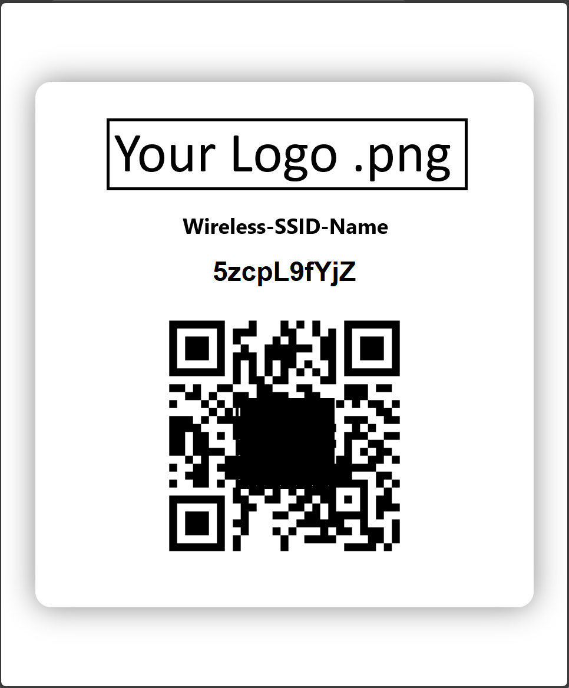
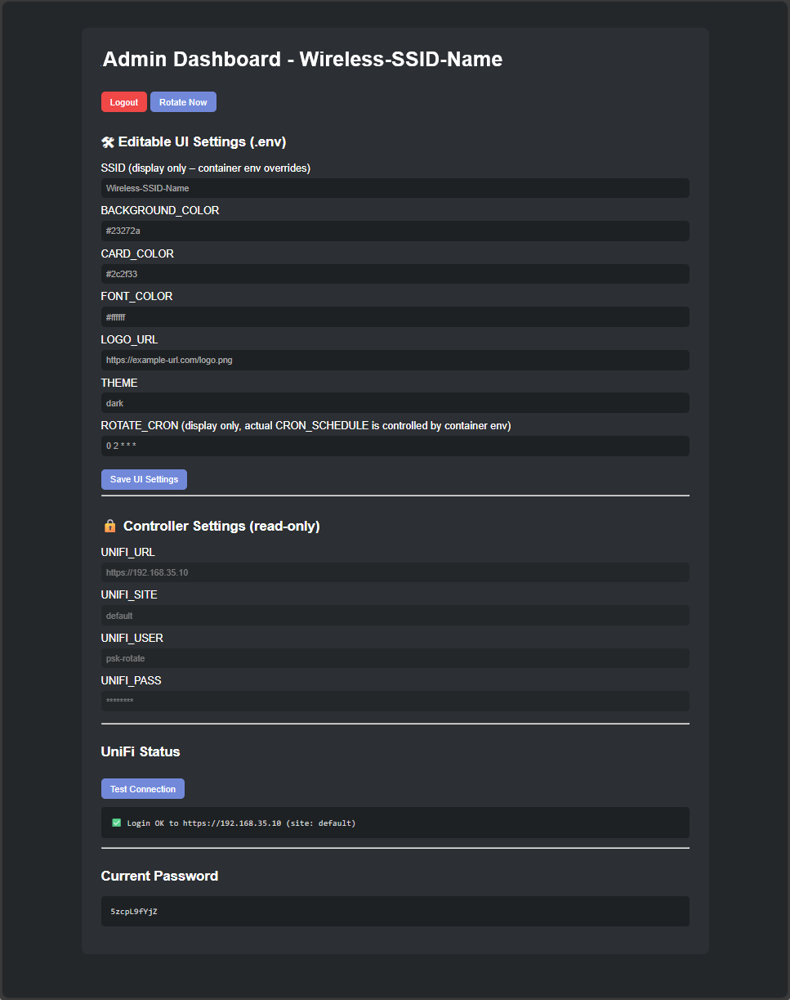

# UniFi Guest Wi-Fi PSK Rotator + QR Kiosk Page

This project automatically rotates a UniFi Guest Wi-Fi Pre-Shared Key (PSK), updates a branded kiosk webpage with the new password and QR code, and provides an admin page for manual rotation.  
Supports **Podman**, **Docker**, and **Linux (systemd/cron)** deployments.

---

## Environment Variables

These can be provided via `.env` (Linux/Docker) or `-e` flags (Podman).

### Required

| Variable | Description | Example |
|--------|------------|---------|
| `WIFI_SSID` | UniFi Wi-Fi network name (PSK will be rotated on this SSID) | `Integrity-Guest` |
| `UNIFI_URL` | Base URL of UniFi Controller / UniFi OS (no `/proxy/network`) | `https://192.168.1.10` |
| `UNIFI_SITE` | UniFi site name | `default` |
| `UNIFI_USER` | UniFi API user (local or SSO-backed) | `psk-rotate` |
| `UNIFI_PASS` | UniFi API user password | `StrongPassword` |
| `ADMIN_KEY` | Secret key required to access admin page | `supersecret123` |
| `UNIFI_CONTROLLER_TYPE` | Controller type: `unifi_os` or `standalone` | `unifi_os` |

---

### Optional – Branding & UI

| Variable | Description | Default |
|--------|------------|---------|
| `LOGO_URL` | Logo displayed on kiosk page | none |
| `BACKGROUND_URL` | Full-page background image | none |
| `THEME` | UI theme (`light` or `dark`) | `light` |
| `BG_COLOR` | Page background colour | `#000000` |
| `INNER_COLOR` | Card / inner container colour | `#ffffff` |
| `TEXT_COLOR` | Primary text colour | `#ffffff` |

---

### Optional – Automation

| Variable | Description | Default |
|--------|------------|---------|
| `ROTATE_CRON` | Cron schedule **inside container** for PSK rotation | `0 3 * * *` |

---

### Example `.env`

```env
WIFI_SSID=guest-wifi
UNIFI_URL=https://192.168.1.10
UNIFI_SITE=default
UNIFI_USER=psk-rotate
UNIFI_PASS=supersecretunifiadminpassword123
UNIFI_CONTROLLER_TYPE=unifi_os

ADMIN_KEY=supersecretguiadminpassword123

LOGO_URL=https://example.com/logo.png
BACKGROUND_URL=https://example.com/bg.jpg
THEME=light
BG_COLOR=#000000
INNER_COLOR=#ffffff
TEXT_COLOR=#ffffff

ROTATE_CRON="0 2 * * *"

---

## Podman Deployment (Recommended)

### Initial Deploy / Redeploy

```bash
podman run -d \
  --pull=always \
  --name <Your-Container-Name> \
  --replace \
  -p 80:80 \
  -e WIFI_SSID=<SSID-Name> \
  -e LOGO_URL="https://<Image-URL>" \
  -e UNIFI_URL="https://<Unifi-IP>" \
  -e UNIFI_SITE=default \
  -e UNIFI_USER=<Unifi-Local-Admin-Username> \
  -e UNIFI_PASS="<Unifi-Local_Admin-Password>" \
  -e ADMIN_KEY=<Set-Admin-Panel-Password> \
  -e UNIFI_CONTROLLER_TYPE=unifi_os \
  -e ROTATE_CRON="0 2 * * *" \
  docker.io/adamwilton/unifi-guest-wifi-kiosk:latest
```

### Access
- **Kiosk:** `http://<host-ip>/`
- **Admin:** `http://<host-ip>/admin.php`
- **Admin Auto Login:** `http://<host-ip>/admin.php?key=ADMIN_KEY`

---

### Podman Maintenance

#### Stop & delete container
```bash
podman stop sydney_guest_wifi_kiosk
podman rm sydney_guest_wifi_kiosk
```

#### Delete image
```bash
podman rmi docker.io/adamwilton/unifi-guest-wifi-kiosk:latest
```

#### Clean redeploy
```bash
podman run -d \
  --pull=always \
  --name <Your-Container-Name> \
  --replace \
  -p 80:80 \
  -e WIFI_SSID=<SSID-Name> \
  -e LOGO_URL="https://<Image-URL>" \
  -e UNIFI_URL="https://<Unifi-IP>" \
  -e UNIFI_SITE=default \
  -e UNIFI_USER=<Unifi-Local-Admin-Username> \
  -e UNIFI_PASS="<Unifi-Local_Admin-Password>" \
  -e ADMIN_KEY=<Set-Admin-Panel-Password> \
  -e UNIFI_CONTROLLER_TYPE=unifi_os \
  -e ROTATE_CRON="0 2 * * *" \
  docker.io/adamwilton/unifi-guest-wifi-kiosk:latest
```

---

## Docker Deployment

```bash
docker build -t unifi-guest-wifi-kiosk .
docker run -d --restart unless-stopped -p 8080:80 --env-file .env --name unifi-guest-wifi-kiosk unifi-guest-wifi-kiosk
```

---

## Linux Deployment (No Containers)

```bash
apt install -y php php-curl php-cli composer qrencode wget unzip
cd /var/www
wget https://github.com/teehee175/unifi-guest-wifi-kiosk/archive/refs/heads/main.zip -O kiosk.zip
unzip kiosk.zip
rm kiosk.zip
mv unifi-guest-wifi-kiosk-main html
cd /var/www/html
composer install --no-dev
chmod +x rotate.sh
chown -R www-data:www-data /var/www/html
```

---

## systemd Service & Timer

See README for full unit definitions.

---

## File Structure

```text
/var/www/html/
├── index.php
├── admin.php
├── changePSK.php
├── rotate.sh
├── qrCode.php
├── status.php
├── .env
├── qrcode.png
└── assets/
```

---

## How It Works

1. Authenticates to UniFi Controller
2. Generates a secure random PSK
3. Updates the Wi-Fi network
4. Generates a QR code
5. Updates the kiosk display instantly

---

## Screenshots

### Kiosk Screen    /    ### Admin Panel
    

### Admin Panel


